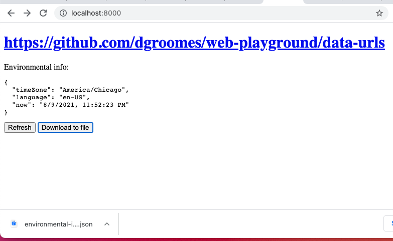

# data-urls

A *Data URLs* example which shows how to download client side content as a file.

## Description

This sub-project defines a simple web page that illustrates the Data URLs feature. Data URLs encode content in a URL which
conveniently lets the user download a file containing that content. No server interaction or separate page is necessary!

## Instructions

* Run a local web server:
    * `python3 -m http.server --directory src/`
* Open the browser
    * Open the browser and navigate to <http://localhost:8000>
* Download the file!
    * Click the download button to download the highlighted "environmental info" content as a file. This is awesome!
    * It will look something like this:
      

## Reference

* [MDN Web Docs: *Data URLs*](https://developer.mozilla.org/en-US/docs/Web/HTTP/Basics_of_HTTP/Data_URIs)
* [MDN Security Blog: *Blocking Top-Level Navigations to data URLs for Firefox 59*](https://blog.mozilla.org/security/2017/11/27/blocking-top-level-navigations-data-urls-firefox-59/)
