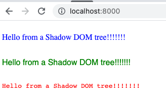

# shadow-dom

A Shadow DOM example.


## Instructions

Follow these instructions to build and run the demo.

1. Run a local web server:
    * ```shell
      python3 -m http.server --directory src/
      ```
2. Open the browser
    * Open the browser and navigate to <http://localhost:8000>
    * You will see differently styled elements; one for each Shadow DOM tree (screenshot below):
    


## Reference

* [MDN Web Docs: *How do you set up a local testing server?*](https://developer.mozilla.org/en-US/docs/Learn/Common_questions/set_up_a_local_testing_server)
* [MDN Web Docs: *Using templates and slots*](https://developer.mozilla.org/en-US/docs/Web/Web_Components/Using_templates_and_slots)
    * This particular point jumped out at me as particularly obscure but useful to know:
      > Note: An unnamed \<slot> will be filled with all of the custom element's top-level child nodes that do not have the slot attribute. This includes text nodes.
* [Python docs: *`http.server` -- HTTP servers*](https://docs.python.org/3/library/http.server.html)
* [Chrome Developers: *New in Chrome 90*](https://developer.chrome.com/blog/new-in-chrome-90/#declarative)
* [Web.dev: *Declarative Shadow DOM*](https://web.dev/declarative-shadow-dom/)
